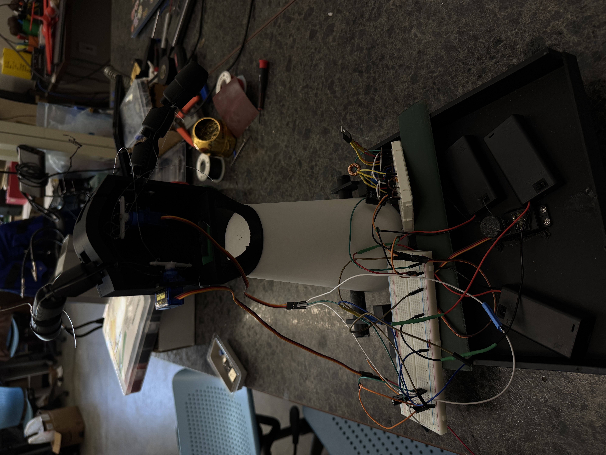
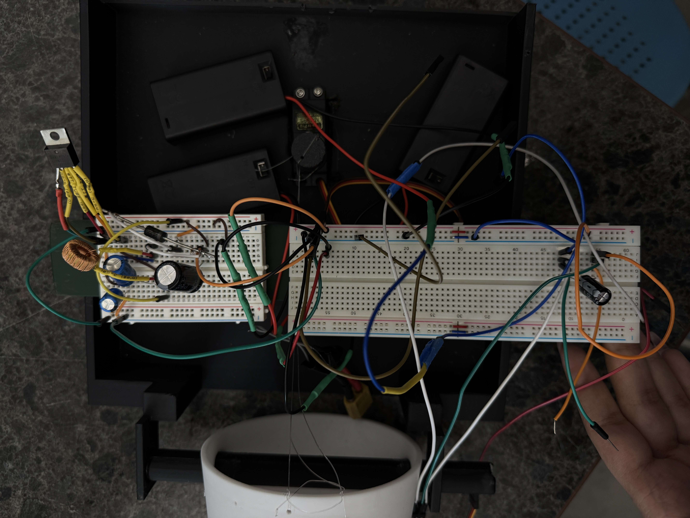

# NeuroArm — Wireless EEG-Controlled Robotic Arm

**CSUB Senior Design Project | ECE4928 | Class of 2025**  
**Team:** Nour Ammar · Johann Herring · Gareth Ogunjobi · Dr. Amin Malek (Advisor)  
**Presented & demonstrated at the CSUB Senior Design Expo, May 2025**

---

## Overview

NeuroArm is a wireless brain-computer interface (BCI) system that processes EEG motor-imagery data using digital signal processing in MATLAB, transmits classified commands wirelessly over UDP/Wi-Fi to an ESP32 microcontroller, and drives a 3D-printed 2-DOF robotic arm using servo motors.

The system uses a pre-recorded motor-imagery EEG dataset rather than a live headset — the architecture is designed for real-time BCI control, but the prototype was validated using pre-recorded C4 channel data to focus development time on the signal processing, communication, and actuation layers.


*Final assembled prototype — 3D-printed arm with servo actuators, breadboard electronics, and power supply. Demonstrated live at CSUB Senior Design Expo, May 2025.*

---

## System Architecture

```
c4_motor_downsampled.csv  (pre-recorded motor-imagery EEG, C4 channel, 125 Hz)
        │
        ▼
EEG_Final.m  (MATLAB)
  - Multi-section SOS Butterworth bandpass filters
      • Mu band: 8–12 Hz  (9 sections)
      • Beta band: 13–30 Hz  (8 sections)
  - RMS envelope extraction (125-sample window)
  - Threshold-based classification (threshold: 0.5)
      → cmd byte: 0, 2, 8, or 10
  - UDP send to ESP32 + ACK wait
        │
        ▼  UDP over Wi-Fi (SoftAP — no router needed)
        │  SSID: NeuroArmAP_Test  |  IP: 192.168.4.1  |  Port: 4210
        ▼
SoftAP_NeuroArm.ino  (ESP32)
  - Hosts SoftAP, listens for UDP packets on port 4210
  - Parses command integer
  - Drives 3 servo motors via PWM on GPIO 18, 19, 21 (standard GPIO pins with PWM capability via ESP32 ledc peripheral)
  - Sends ACK back to MATLAB
        │
        ▼
3D-Printed Robotic Arm (2 DOF)
  - Finger flexion/extension (servos on GPIO 18, 19)
  - Elbow rotation (servo on GPIO 21)
```

---

## EEG Signal Processing

EEG data is sourced from a pre-recorded motor-imagery dataset (C4 channel, downsampled to 125 Hz). The DSP pipeline applies cascaded multi-section SOS Butterworth filters to isolate motor-relevant frequency bands, then extracts RMS envelopes over a 125-sample sliding window for threshold-based classification.

**Filters:**

| Band | Frequency | Sections |
|------|-----------|----------|
| Mu | 8–12 Hz | 9 SOS sections |
| Beta | 13–30 Hz | 8 SOS sections |

**Classification logic (RMS threshold = 0.5):**

| Mu Active | Beta Active | Command | Motion |
|-----------|-------------|---------|--------|
| ✓ | ✗ | 2 | Fingers close |
| ✓ | ✓ | 10 | Fingers close, elbow holds position |
| ✗ | ✓ | 8 | Elbow rotate |
| ✗ | ✗ | 0 | No motion |

Note: Classification is threshold-based with no formal validation set or confusion matrix — proof-of-concept implementation.

---

## ESP32 Command Mapping

| Command | Action |
|---------|--------|
| `2` | Fingers → 180°, hold 2s, return to 0° |
| `8` | Elbow → current + 100°, hold 2s, return |
| `10` | Fingers close, elbow holds current position |
| other | Ignored |

---

## Performance

### UDP Network (MATLAB → ESP32 → MATLAB)
| Metric | Value |
|--------|-------|
| First-attempt success rate | ~70% |
| Observed packet drop rate | ~30% |
| RTT on successful packets | 40–58 ms |

UDP is connectionless with no guaranteed delivery. A ~30% first-attempt drop rate was observed, consistent with expected SoftAP Wi-Fi behavior. `EEG_Final.m` sends one command per run and waits for a single ACK — if none is received, a warning is printed and the script exits. The demo required one command execution (cmd 10): fingers close while elbow holds its current position.

### Servo Motion
| Command | Approx. Start Delay | Motion Duration |
|---------|---------------------|-----------------|
| Fingers (cmd 2) | ~5 ms | ~620 ms |
| Elbow (cmd 8) | ~5 ms | ~360 ms |
| Both (cmd 10) — fingers close, elbow holds | ~5 ms | ~620 ms |

Values are approximate — formal repeated-trial timing was not conducted.

### Reliability Observations
- No ESP32 resets or SoftAP dropouts observed after dedicated BEC power supply was added
- Servo motion consistent and repeatable across all successful command deliveries

---

## Hardware

| Component | Purpose |
|-----------|---------|
| ESP32-WROOM-32D | Microcontroller, Wi-Fi SoftAP, PWM servo driver |
| Tower Pro MG995 | High-torque servo — GPIO 21 (elbow lift) |
| Small hobby servos (×2) | Finger actuation — GPIO 18, 19 |
| 5V 3A BEC | Dedicated servo power (prevents ESP32 brownout) |
| 330 µF + 0.1 µF capacitors | Decoupling on servo supply rail |
| 3D-printed PLA frame | Robotic arm structure |
| 17 lb monofilament fishing line | Finger actuation |



*Power supply and breadboard circuit supporting the ESP32, one Tower Pro MG995 (elbow), and two hobby servo motors (fingers).*

---

## Software Stack

| Tool | Role |
|------|------|
| MATLAB (`udpport`, `filter`) | EEG DSP pipeline + UDP communication |
| Arduino IDE + Arduino-ESP32 | ESP32 firmware |
| ESP32Servo library | PWM servo control |
| Git / GitHub | Version control |

---

## Key Engineering Challenges Solved

**Campus network blocking UDP:** ESP32 configured as SoftAP (`NeuroArmAP_Test`) creating a direct point-to-point link — no router needed.

**ESP32 boot-mode conflict:** GPIO 0/2/5 blocked flashing. Moved PWM to GPIO 18/19/21.

**Servo brownout resets:** Added dedicated 5V/3A BEC with decoupling capacitors — eliminated ESP32 resets under load.

**Servo startup jitter:** Writing 0° home position in `setup()` before network loop starts.

**Finger actuation:** Replaced rigid piano wire with 17 lb monofilament on double-sided control horn.

**Forearm weight:** Shortened and thinned 3D-printed forearm to reduce elbow servo load.

---

## Repository Structure

```
NeuroArm/
├── EEG_Final.m                # MATLAB: full DSP pipeline + UDP sender
├── SoftAP_NeuroArm.ino        # ESP32 firmware: SoftAP, UDP receiver, servo control
├── c4_motor_downsampled.csv   # Pre-recorded motor-imagery EEG dataset (C4 channel, 125 Hz)
├── arm.jpeg                   # Final assembled prototype photo
├── electronics.jpeg           # Electronics/breadboard closeup
└── README.md
```

---

## My Contributions (Nour Ammar)

- Configured ESP32 SoftAP Wi-Fi network layer
- Resolved boot-mode GPIO conflict: moved PWM signals from strapping pins (GPIO 0/2/5) to standard PWM-capable GPIO 18/19/21
- Wrote full ESP32 firmware (`SoftAP_NeuroArm.ino`): UDP parsing, PWM servo control, ACK response
- Wrote the UDP communication layer in `EEG_Final.m`: sends classified command to ESP32 and handles ACK confirmation
- Led system integration, debugging, and end-to-end testing across all subsystems

---

## Authors

| Name | Role |
|------|------|
| Nour Ammar | Project Lead, Embedded Systems & Firmware, Network Layer |
| Johann Herring | DSP Pipeline, EEG Signal Processing |
| Gareth Ogunjobi | Power Electronics & Mechanical Design |

---

*California State University, Bakersfield — Department of Electrical Engineering & Computer Science*  
*ECE4928 Senior Project — Spring 2025*
